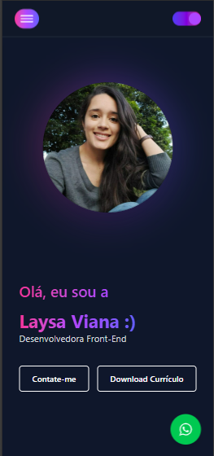
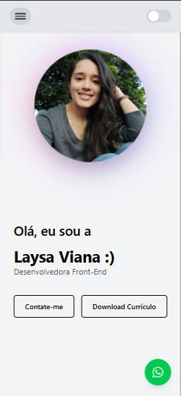
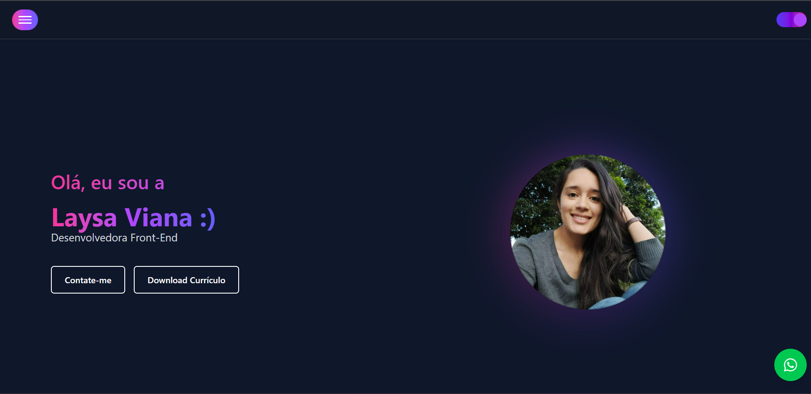
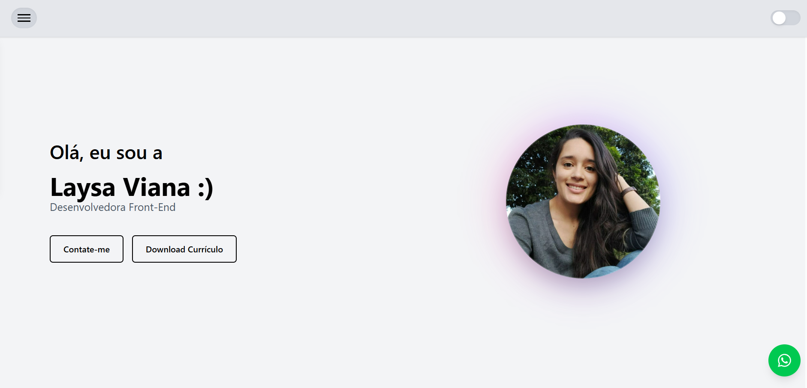
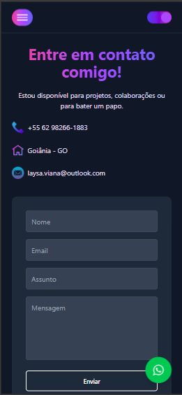
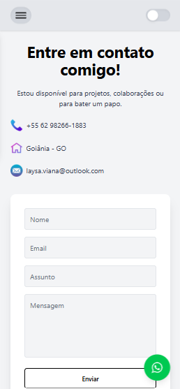
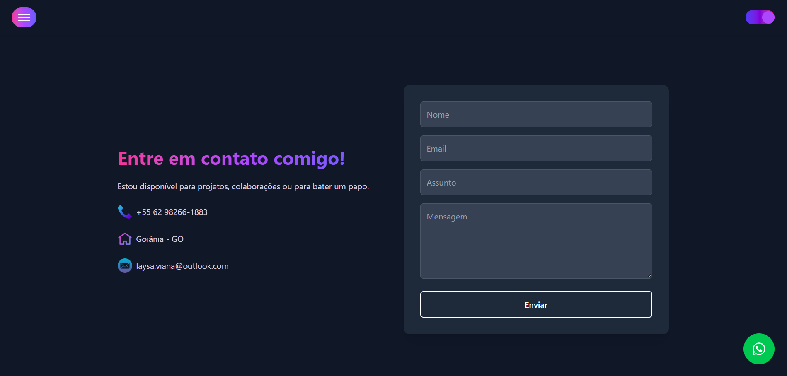
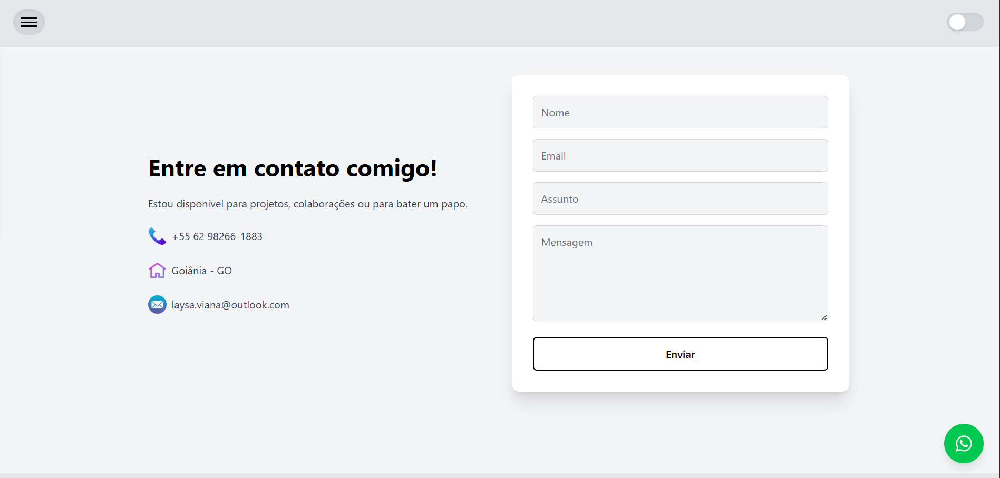

# 💻 Portfólio — Laysa Viana

Bem-vindo(a) ao meu portfólio! Este projeto foi desenvolvido com o objetivo de apresentar minhas experiências, habilidades e projetos de forma moderna, interativa e responsiva.

---

## 🧠 Visão Geral

Este portfólio foi construído utilizando **React com Vite** e **TypeScript**, buscando performance, organização e escalabilidade.  
Os dados dinâmicos (sobre mim, experiências, projetos e contatos) são carregados via **React Query**, integrados à API do **JSONBin**.  
O formulário de contato utiliza o **Formspree**, facilitando o envio de mensagens diretamente pelo site.

---

## ✨ Funcionalidades Principais

- 🔹 **Seções dinâmicas** (Sobre, Experiências, Projetos, Contato) consumindo dados de uma API pública (JSONBin)
- 🔹 **Formulário funcional** com integração ao **Formspree**
- 🔹 **Cache inteligente e revalidação automática** com **React Query**
- 🔹 **Animações suaves** de entrada e scroll com **Framer Motion**
- 🔹 **Modo claro e escuro** totalmente estilizado com **TailwindCSS**
- 🔹 **Layout responsivo**, adaptado para desktop e mobile
- 🔹 **Validação de formulário** com **Yup** e **Formik**
- 🔹 **Feedbacks visuais** (loading, erros, sucessos) com **React Hot Toast**

---

## 🧩 Tecnologias Utilizadas

### 🖥️ Frontend

- [React](https://react.dev/)
- [Vite](https://vitejs.dev/)
- [TypeScript](https://www.typescriptlang.org/)
- [TailwindCSS](https://tailwindcss.com/)
- [Framer Motion](https://www.framer.com/motion/)

### ⚙️ Estado & Dados

- [@tanstack/react-query](https://tanstack.com/query/latest)
- [JSONBin API](https://jsonbin.io)
- [Formspree](https://formspree.io)

### 🧰 Utilitários

- [Formik](https://formik.org/)
- [Yup](https://github.com/jquense/yup)
- [React Hot Toast](https://react-hot-toast.com/)
- [Lucide React Icons](https://lucide.dev/)

---

## 🔗 Integrações

### 🗄️ JSONBin

Os dados do portfólio (sobre, experiências, projetos e contatos) são armazenados em um **bin público** no JSONBin.  
O React Query faz a requisição e mantém o cache dos dados por 10 minutos, garantindo performance e evitando chamadas desnecessárias.

## 🖥️ Preview do projeto

### Tela Inicial

  
  
  

  
  

### Tela de Contato

  
    
    

    

    
        

